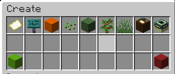

# Create GUI

## Component Types

`Shuffle`: Click to cycle the options. The option currently selected is in the name of the item currently in the slot.

`Link`: Click on the item to open the selection menu. Make your selection by clicking any one of the options in the selection menu. The currently selected option will be shown in the name of the item in the main GUI.

`Text`: Click on the item to open an anvil GUI. Type your choice into the renaming box and click the green concrete in the result slot to submit.

## GUI

## Options

These are listed in order of being shown

### World Like Selector

Type: `Link`

Sets the default behaviour of the dimension, based off an existing world.

### World Identifier

Type: `Text` (`Identifier`)

Sets the `Identifier` of the dimension. Must be in the format of `namespace:value`

### Difficulty Selector

Type: `Shuffle`

Sets the difficulty to be used in the world.

### Seed

Type: Text (`long`)

Sets the seed of the chunk generator used in the dimension. Must be a numerical value (cannot contain letters)

### Generator Type

Type: `Shuffle`

Sets the type of chunk generator used in the world.

##### Types

`Noise`: Standard chunk generator

`Flat`: Generates a flat world

`Void`: Generates a world with no terrain

### Biome Source

Type: `Link`

Sets the biome source of the world. You can select the biome source of any of the existing worlds to be used

#### Fixed Biome Source

If you want your world to be a single biome, you can select the oak sign in the biome source menu. Enter the identifier of the biome you want to set the biome source.

### Generator Settings

Type: `Shuffle`

Sets the shape of the terrain made by the generator.

#### Options

`Overworld`: Standard overworld terrain

`Amplified`: Amplified overworld terrain

`Large Biomes`: Large biomes overworld terrain

`Nether`: Nether terrain

`End`: End terrain

`Caves`: A world composed entirely of caves

`Islands`: A world composed of floating islands

## Create

When finished, click the lime concrete to create your world.