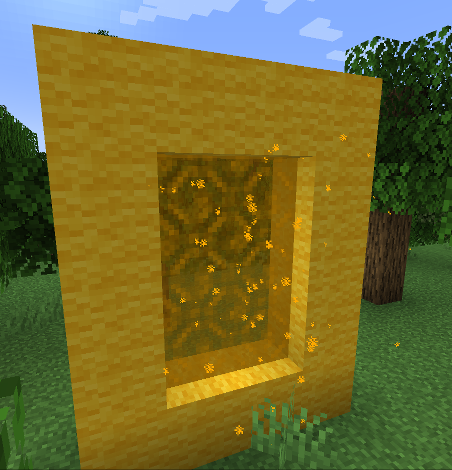

# Portals

Interdimensional supports customisable portals through the [Portal Command](commands/portal.md)

## Permissions

You can control who can use each portal using permissions

Portal access is controlled by using the `permission` property in the portal command, which is 0 by default.

If this value is set to 0, anyone can use the portal.

If the value is above 0, you can only use the portal if you have the permission level specified by this value. Alternatively, you can grant the `interdimensional.visit.<dimension_identifier>`.

The permission for an example dimension would be `interdimensional.visit.example:dev`